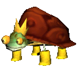

<!-- HEADER -->

 

    

<h3 align="center">PsyTracker</h3>

    Psychonauts Randomizer item tracker
     
     
  

<!-- ABOUT -->

## About

Currently a work in progress. The aim with this project is to create an item tracker as a companion app with the Psychonauts Randomizer: [PsychoRando](https://github.com/Akashortstack/PsychoRando)

## Dev Roadmap

### Things I gotta do for a v1 release

* Drag and drop

* Save/Load Progress

* Manual item view settings

### v2

* Dynamic item rendering based off randomizer settings 

* Autotracking

* Hint System

### Built With

* [C#](https://learn.microsoft.com/en-us/dotnet/csharp/tour-of-csharp/)

* [.NET 6](https://dotnet.microsoft.com/)

* [Windows Presentation Foundation](https://learn.microsoft.com/en-us/dotnet/desktop/wpf/overview/?view=netdesktop-8.0)

<!-- GETTING STARTED -->

## Getting Started

### Prerequisites

Lorem Ipsum

### Installation

Lorem Ipsum

<!-- USAGE EXAMPLES -->

## Usage

Use this space to show useful examples of how a project can be used. 

<!-- CONTRIBUTING -->

## Contributing

Any contributions you make are **greatly appreciated**.

If you have a suggestion that would make this better, please fork the repo and create a pull request.

1. Fork the Project
2. Create your Feature Branch (`git checkout -b feature/MyGreatFeatureRequest`)
3. Commit your Changes (`git commit -m 'Add some features'`)
4. Push to the Branch (`git push origin feature/MyGreatFeatureRequest`)
5. Open a Pull Request

(<a href="#top">back to top</a>)
