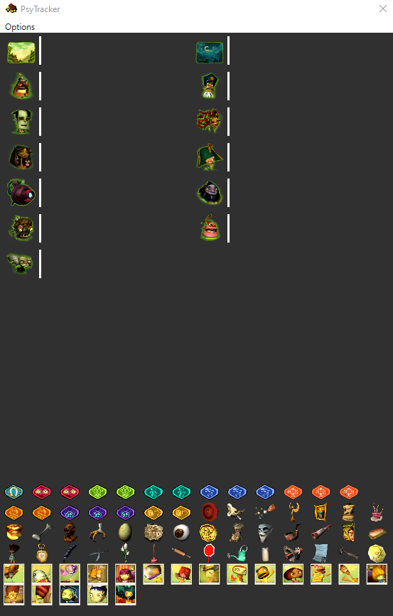

<!-- HEADER -->

 

    

<h3 align="center">PsyTracker</h3>

<!-- ABOUT -->

## About

Currently a work in progress. The aim with this project is to create an item tracker as a companion app with the Psychonauts Randomizer: [PsychoRando](https://github.com/Akashortstack/PsychoRando)

## Dev Roadmap

### Things I gotta do for a v1 release

* ~~Drag and drop~~

* Autotracking

* Save/Load Progress

### v2

* Hint System
* Item View Settings

<!-- GETTING STARTED -->

## Getting Started

### Prerequisites

This app may require that you have the [.NET 6 Desktop Runtime](https://dotnet.microsoft.com/en-us/download/dotnet/6.0) installed.

### Installation

Simply download the app from this repository's releases page and run PsyTracker.exe 

This application is unsigned, so you may receive a warning before when first launching the app. 

<!-- USAGE EXAMPLES -->

## Usage

Currently, only drag and drop functionatily is implemented. When you collect an item in game you will need to alt tab out of it and manually drag items to their found locations. 

Alt tabbing in Psychonauts will pause the game and, if you are running it in fullscreen, will minimize it. I recommend to run Psychonauts in windowed mode for a smoother experience. 

There is a known bug where tabbing out of Psychonauts during loading screens and cutscenes could potentially crash the game. Try to only tab out when you have player control, or pause first.

## For Developers

The following few sections are for those who are interested in developing PsyTracker.

### Built With

- [C#](https://learn.microsoft.com/en-us/dotnet/csharp/tour-of-csharp/)

- [.NET 6](https://dotnet.microsoft.com/en-us/download/dotnet/6.0)

- [Windows Presentation Foundation](https://learn.microsoft.com/en-us/dotnet/desktop/wpf/overview/?view=netdesktop-8.0)

### Setting up a Development Environment

You can build and run the application from [Visual Studio 2022](https://visualstudio.microsoft.com/vs/) by opening the solution file, going to Build > Build Solution and then click the Run button. You can also do this from the CLI with the following commands:

`cd /PsyTrackerApp`

`dotnet build` 

`dotnet run`

<!-- CONTRIBUTING -->

## Contributing

Any contributions you make are **greatly appreciated**.

If you have a suggestion that would make this better, please fork the repo and create a pull request.

1. Fork the Project
2. Create your Feature Branch (`git checkout -b feature/MyGreatFeatureRequest`)
3. Commit your Changes (`git commit -m 'Add some features'`)
4. Push to the Branch (`git push origin feature/MyGreatFeatureRequest`)
5. Open a Pull Request

## Special Thanks

* [Akashortstack](https://github.com/Akashortstack) for creating PsychoRando.

* [Jill](https://gitlab.com/scrunguscrungus) for creating the Astralathe Mod loader which makes the randmizer possible.

* [Red-Buddha](https://github.com/Red-Buddha) and [Dee-Ayy](https://github.com/Dee-Ayy) for the KH2Tracker, which this tracker is based off of.

* [Benny](https://github.com/bgbennyboy) for creating the [Double Fine Explorer](https://quickandeasysoftware.net/software/doublefine-explorer) which allows the extraction of assets for games by Double Fine.

(<a href="#top">back to top</a>)
